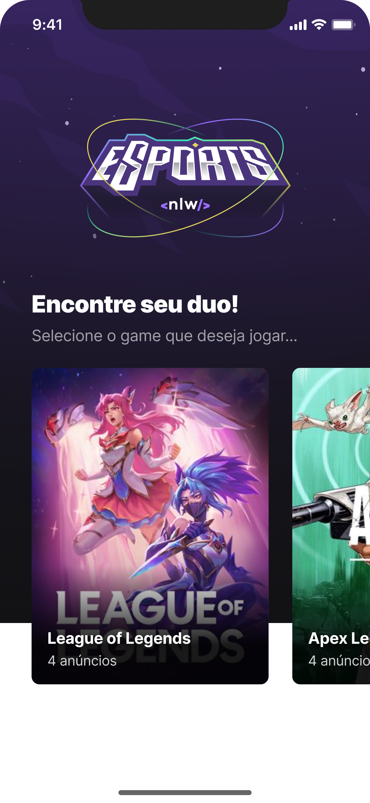

[![LinkedIn][linkedin-shield]][linkedin-url]
[![MIT License][license-shield]][license-url]

<br />
<div align="center">
  <a href="https://github.com/luqiborges/nlw-esports">
    
  </a>

  <h3 align="center">NLW e-Sports</h3>
</div>

## Sobre o Projeto

<div align="center" >
  <a href="https://github.com/luqiborges/nlw-esports">
    
    
  </a>
</div>
<br/>

Este projeto se consiste em uma aplicação que permite ao usuário publicar um anúncio contendo informações sobre si mesmo a fim de encontrar um parceiro de jogo. Assim, outro usuário consegue visualizar os anúncios publicados para cada jogo e encontrar seu duo.

A aplicação possui interface Web e Mobile.

<br/>

## Tecnologias Utilizadas

This section should list any major frameworks/libraries used to bootstrap your project. Leave any add-ons/plugins for the acknowledgements section. Here are a few examples.

* ReactJS
* ReactNative
* NodeJS
* TailwindCSS
* SQLite
* Typescript

<br/>

## Execução

- ### **Pré-requisitos**

  - Ter instalado em sua máquina o **[Expo](https://expo.io/)** e no seu dispositivo móvel, caso utilize.
  - Ter intalado o **[NodeJS](https://nodejs.org/en/)**.
  - A instalação da biblioteca **[React Native](https://reactnative.dev/)** na versão mais recente.
  - Ter o **[Git](https://git-scm.com/)** (v2.29.0 for Windows) instalado e configurado no computador.
  - Ter o **[NPM](https://www.npmjs.com/)** instalado em sua versão mais recente.

1. Clone o repositório

```sh
  $ git clone https://github.com/luqiborges/nlw-esports.git
```

2. Acesse o repositório server e execute o servidor backend:

```sh
  $ npm run dev
```

3. Acesse o repositório web e rode a interface no seu navegador:

```sh
  $ npm run dev
```

4. Acesse o repositório mobile e rode a aplicação através do Expo em seu simulador ou dispositivo móvel:
```sh
  expo start ou npx expo start
```

5. Prontinho


<!-- MARKDOWN LINKS & IMAGES -->
[product-screenshot]: web/src/assets/Landing.png
[product-screenshot-mobile]: web/src/assets/Home.png

<!-- MARKDOWN LINKS & IMAGES -->
<!-- https://www.markdownguide.org/basic-syntax/#reference-style-links -->
[license-shield]: https://img.shields.io/github/license/othneildrew/Best-README-Template.svg?style=for-the-badge
[license-url]: https://github.com/othneildrew/Best-README-Template/blob/master/LICENSE.txt
[linkedin-shield]: https://img.shields.io/badge/-LinkedIn-black.svg?style=for-the-badge&logo=linkedin&colorB=555
[linkedin-url]: https://www.linkedin.com/in/souzaborgeslucas/

